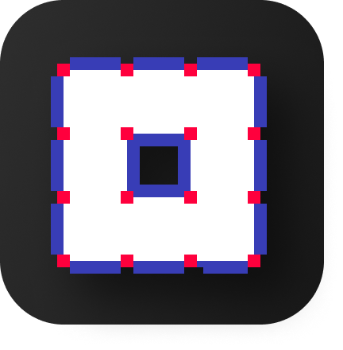
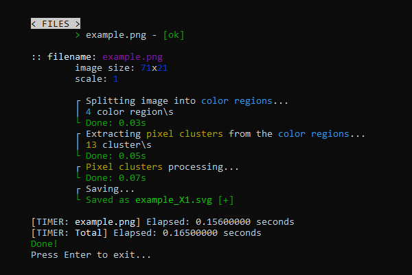
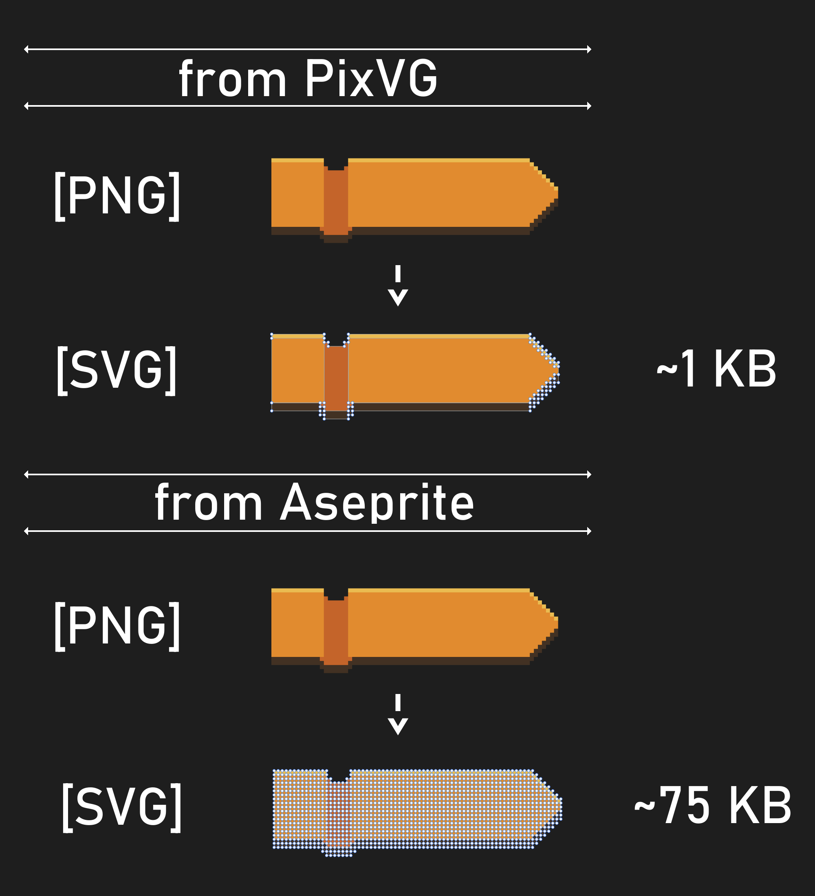

# PixVG

# About

**PixVG** is a small **CLI utility** for tracing pixel-style arts/sprites/logos/icons to SVG. It optimizes the resulted SVG, so every connected color region *(Connected in terms of Von Neumann neighborhood or 4-neighborhood)* will be separated from others.

Its intended to be used in **pixel-style (web) design** , because it works very well with duotone logos, icons and other elements where you can find farily large *(For pixel art)* areas of connected colors. Of course, You can easily colorize duotone SVG later, for example, using CSS. So it is flexible approach. Scaling pixel-style stuff is quite a problem, but SVG is easy scaleable.

As for real pixel arts with a lot of colors and big amount of small pixel clusters PixVG will result pretty heavy SVG files. It is **NOT** magical tool.

Hope it will help you!

# Ver 1.0

- Supports [-s int] [--scale int] command line arguemnt: to apply scale to resulted SVGs.

- <./in> - input folder (Created automatically);

- <./out> - output folder (Created automatically).

> **Note**
> 
> Transparent pixels will be ignored.
> 
> Max image size 512x512 px (Softlock, see pixvg.py line: 661 for ver1.0).
> 
> Supports only .png files (Softlock, see pixvg.py line: 623 for ver1.0).

### Dependency

1. numpy;
2. pillow (PIL);
3. click.

_Builded with python 3.11.1 on Win10 x64 with pyinstaller_

# Examples

1. Console output:

2. Comparison with Aseprite:

